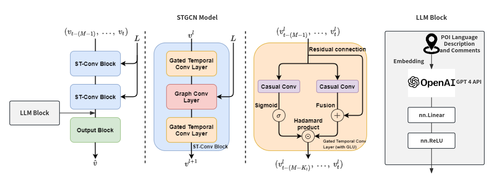

# MIT-Summer-Camp-MobilityAI

## About

Our project focuses on applying large language models (LLMs) to mobility and transportation forecasting. We propose a new model called STGCN-L that incorporates LLMs into spatio-temporal graph convolutional networks for predicting future traffic conditions.

## Related works
1. TCN: [*An Empirical Evaluation of Generic Convolutional and Recurrent Networks for Sequence Modeling*](https://arxiv.org/abs/1803.01271)
2. GLU and GTU: [*Language Modeling with Gated Convolutional Networks*](https://arxiv.org/abs/1612.08083)
3. ChebNet: [*Convolutional Neural Networks on Graphs with Fast Localized Spectral Filtering*](https://arxiv.org/abs/1606.09375)
4. GCN: [*Semi-Supervised Classification with Graph Convolutional Networks*](https://arxiv.org/abs/1609.02907)
4. STGCN: [*Spatio-Temporal Graph Convolutional Networks: A Deep Learning Framework for Traffic Forecasting*](https://arxiv.org/abs/1709.04875)

## Related code
1. TCN: https://github.com/locuslab/TCN
2. ChebNet: https://github.com/mdeff/cnn_graph
3. GCN: https://github.com/tkipf/pygcn
3. STGCN-PyTorch: https://github.com/hazdzz/STGCN/tree/main

## STGCN-L Model Structure

